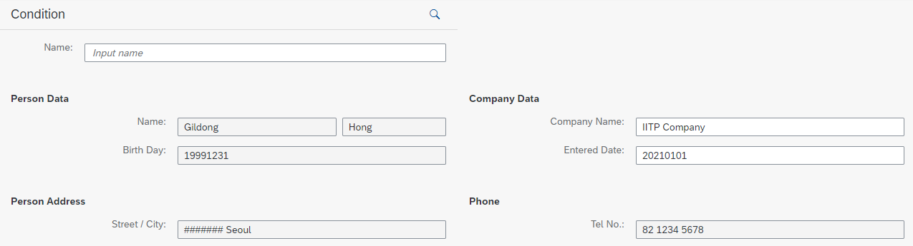
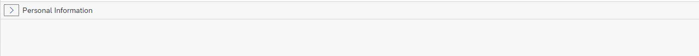
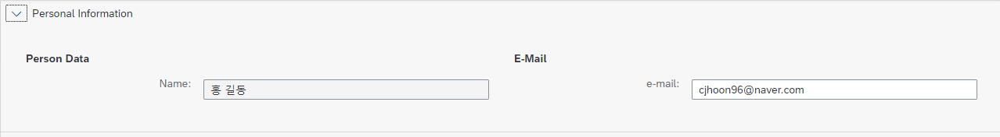

# UNIT 7. Layout Controls


# Lesson 1. Using Layout Controls


xmlns:l="sap.ui.layout"


* ## sap.ui.layout.VerticalLayout Control

  #### iitp.zclb23_005.view.View1.view.js

  ```xml
  <mvc:View
      controllerName="iitp.zclb23005.controller.View1"
      xmlns:mvc="sap.ui.core.mvc"
      displayBlock="true"
      xmlns="sap.m"
      xmlns:l="sap.ui.layout"
  >
      <Shell id="shell">
          <App id="app">
              <pages>
                  <Page id="page" title="{i18n>title}">
                      <l:VerticalLayout id = 'idVert'>
                          <l:content>
                              <Label id="lblTeam" text="Team Name"></Label>
                              <Input id = "inpTeam" description="Enter Team Name"></Input>
                              <Button id = "btnSearch" text="Search" press = "onSearch"></Button>
                          </l:content>
                      </l:VerticalLayout>
                  </Page>
              </pages>
          </App>
      </Shell>
  </mvc:View>
  ```

  #### iitp.zclb23_005.controller.View1.controller.js

  ```javascript
  sap.ui.define([
      "sap/ui/core/mvc/Controller",
      "sap/m/MessageBox"   
  ],
      /**
       * @param {typeof sap.ui.core.mvc.Controller} Controller
       */
      function (Controller, MessageBox) {
          "use strict";
  
          return Controller.extend("iitp.zclb23005.controller.View1", {
              onInit: function () {
  
              },
  
              onSearch: function () {
                  var oInput = this.getView().byId("inpTeam");
                  var inpValue = oInput.getValue();
                  var showText = "Hello, " + inpValue;
  
                  MessageBox.show(showText, {
                      title: "Welcome To ...."
                  });
              }
          });
      });
  ```

  


* ## sap.ui.layout.HorizontalLayout Control

  

  

  


* ## sap.ui.layout.Grid Control

  12개의 column

  * ### Phone

  

  #### Ex ) zclb23_007

  ```xml
  <content>
      <l:Grid  id="idGrid1">
          <l:content>
  
              <Label id="lblFrstname" text="First Name">
                  <layoutData>
                      <l:GridData  id="gdFirst" span="L2 M4 S8"></l:GridData>
                  </layoutData>
              </Label>
  
              <Input id="inpFrstname" value="" placeholder="Input name">
                  <layoutData>
                      <l:GridData id="grFirst" span="L2 M4 S8"></l:GridData>
                  </layoutData>
              </Input>
  
  
              <Label id="lblLastname" text="First Name">
                  <layoutData>
                      <l:GridData  id = "gdLast" span = "L2 M4 S8"></l:GridData>
                  </layoutData>
              </Label>
  
              <Input id = "inpLastname" value="" placeholder = "Input name">
                  <layoutData>
                      <l:GridData id="grLast" span="L2 M4 S8"></l:GridData>
                  </layoutData>
              </Input>
  
          </l:content>
      </l:Grid>
  </content>
  ```

  

  


* ## sap.ui.layout.ResponsiveFlowLayout Control

  

  

  


* ## sap.ui.layout.form.Form Control

  ```xml
  <content>
      <f:SimpleForm id="simForm" layout="ResponsiveGridLayout" width="50%">
          <f:toolbar>
              <Toolbar id="toolBar">
                  <Title id="Title" text="Condition"></Title>
                  <ToolbarSpacer id="toolSpace"></ToolbarSpacer>
                  <Button id="btnSch" icon="sap-icon://search"></Button>
              </Toolbar>
          </f:toolbar>
          <f:content>
              <Label id="lblName1" text="Name" labelFor="inpName"></Label>
              <Input id="inpName" value="" placeholder="Input name"></Input>
          </f:content>
      </f:SimpleForm>
  
      <f:SimpleForm id="simForm1">
          <f:content>
              <core:Title id="perData" text="Person Data"></core:Title>
              <Label id="lblName2" text="Name"></Label>
              <Input id="idFrName" value="Gildong" editable="false"></Input>
              <Input id="idLsName" value="Hong" editable="false"></Input>
              <Label id="lblBirDt" text="Birth Day"></Label>
              <Input id="idBirDt" value="19991231" editable="false"></Input>
  
              <core:Title id="compData" text="Company Data"></core:Title>
              <Label id="lblComp" text="Company Name"></Label>
              <Input id="inpComp" value="IITP Company"></Input>
              <Label id="lblEntDt" text="Entered Date"></Label>
              <Input id="inpEntDt" value="20210101"></Input>
          </f:content>
      </f:SimpleForm>
  
      <f:SimpleForm id="simForm2">
          <f:content>
              <core:Title id="perAdd" text="Person Address"></core:Title>
              <Label id="lblAdd" text="Street / City"></Label>
              <Input id="idAddress" value="####### Seoul" editable="false">				</Input>
  
              <core:Title id="tellNum" text="Phone"></core:Title>
              <Label id="lblPhone" text="Tel No."></Label>
              <Input id="idTellNum" value="82 1234 5678" editable="false">				</Input>
          </f:content>
      </f:SimpleForm> 
  </content>
  ```

  

  

  

  

  

  

  

* ## sap.m.Panel Control

  ```xml
  <mvc:View
      controllerName="iitp.zclb23009.controller.View1"
      xmlns:mvc="sap.ui.core.mvc"
      displayBlock="true"
      xmlns="sap.m"
      xmlns:core="sap.ui.core"
      xmlns:f="sap.ui.layout.form"
  >
      <Shell id="shell">
          <App id="app">
              <pages>
                  <Page id="page" title="{i18n>title}">
                      <content>
                      
                          <Panel id="idPanel" expandable="true" expand="true">
                              <headerToolbar>
                                <Toolbar id="toolbar">
                              	<content>
                              	  <Text id="text" text="Personal Information">									</Text>
                                  </content>
                                </Toolbar>
                              </headerToolbar>
                              
                              <content>
                                <f:SimpleForm id="form">
                                  <f:content>
                                    <core:Title id="perData" text="Person Data">									</core:Title>
                                    <Label id="lblName2" text="Name"></Label> 
                                    <Input id="idInput" value="홍길동"
                                            			editable="false"></Input>
                                    <core:Title id= "Email" text="E-Mail">
                                    </core:Title>
                                    <Label id="mail" text="e-mail"></Label>
                                    <Input id="idEmail"
                                           value="cjhoon96@naver.com"></Input>
                                  </f:content>
                                </f:SimpleForm>
                              </content>
                          </Panel>
                      
                      </content>
                  </Page>
              </pages>
          </App>
      </Shell>
  </mvc:View>
  
  ```

  

  

  


개인 과제 회원가입 창 만들기 

동의 체크 박스 클릭시 panel 열리도록 안눌릴시 열리지도 않게