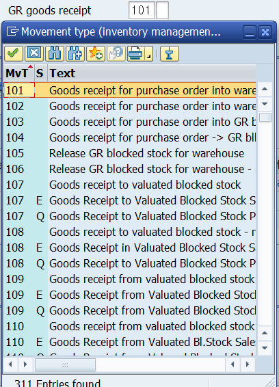

# UNIT 1. Procurement Processes

# Lesson 1. Defining Processes and Organizational Levels in Procurement

* ## External Procurement Process

  * ### Determination of requirements

    MRP(ERP 의 꽃)

    

  * ### Determination of supply source

    

    

  * ### Vendor selection 

    

    

  * ### Purchase order processing 

    

    

  * ### Purchase order monitoring

    

    

  * ### Goods receipt

    

    

  * ### Invoice verification

    

    

  * ### Payment processing 

    

    

    

* ## MM의 기본

  Purchasing 

  Inventory Management

  Logistics Invoice Verification

  예상 매입금을 확정 지어주는 프로세스

  Physical Inventory

* ## Organizational Levels in Procurement

  * ### Client

  * ### Company Code

  * ### Plant

    고유 번호 중복 되지 않게 짜줘야함 

  * ### Storage Location

    Plant dependent 하다. 즉 플랜트 별로 중복 될 수 있다.

  * ### Purchasing Organization and Purchasing Group

  

  

  

# Lesson 2. Maintaining Purchase Orders

* ## Purchase Order Details

  ### Purchase order

  ME21N

  ### =>

  ### Goods receipt

  MIGO

  ### =>

  ### Invoice document

  MIRO

# Exercise 1. 

* ## 시나리오

  

  T-RM123

* ## 실습

  

  

  

  #### Compony Code는 작성하지 않아도 Purchasing Org가 물려있는 것으로 자동 설정된다.

  

  

  

  

  

  

  

  

  

  

# Exercise 2.

* ## 시나리오

  

  

* ## 실습

  #### ME9F

  

  

  

  

  #### 

# Lesson 3. Posting Goods Receipts

# Exercise 3. 

* ## 시나리오

  

  

* ## 실습

   

  

  

  

  

  

  

  

  

  

101 은 입고

122 는 반품

# Lesson 4. Entering Invoices

Transaction 에서 Credit Memo를 통해 적자 세금 계산서를 작성할 수 있다?

 

# Exercise 4. 

* ## 시나리오

  

  

  

* ## 실습

  invoice 번호는 넣으르 필요 없다.

  ***T-CODE MIRO*** 접속

  

  

  #### 이후 저장버튼을 누른다.

  

  #### 이후 확인할 경우

  

  #### 를 통해 들어가거나

  

  

  #### EASY ACCESS에서 위와 같은 경로 또는 *<u>T-CODE MIR4</u>* 로 들어가

  

  #### 확인할 수 있다.

회계는 두가지가 있다.

* ## 제무회계 

  결과물로

  

  * 대차대조표

  * 손익계산서

    

    두가지가 나온다.

  gr?

  GL ACCOUNT 에 저장한다.?

  

  * 차변 Debit

  * 대변 Credit

    

  자산 = 자본 + 부채

  |      | 원자재 |
  | ---- | ------ |
  | 100  |        |

  | GR/IR Clearing |      |
  | -------------: | ---- |
  |                | 100  |

  |      | 원자재 |
  | ---- | ------ |
  | 100  |        |

  

  ### GR IR 개념 꼭 이해하기

* ## 관리회계

