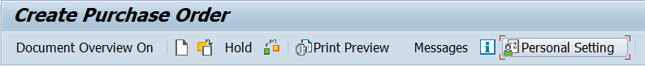
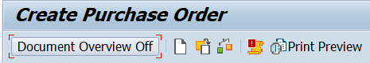
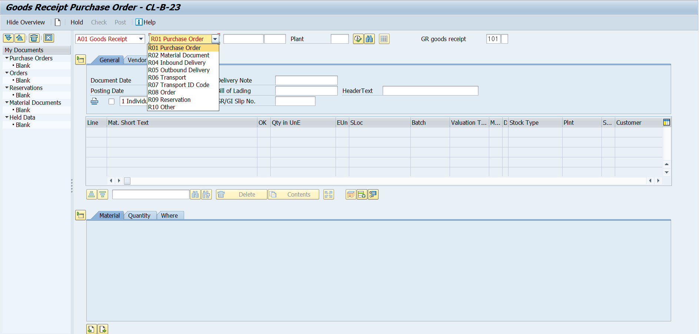

# UNIT 1. Procurement Processes

# Lesson 1. Defining Processes and Organizational Levels in Procurement

* ## External Procurement Process

  * ### Determination of requirements

    #### (소요량 결정)

    구매 부서에 자재 소요량을 알리기 위해 구매 요청을 수동으로 생성한다.

    ***material master*** 에서 자재에 대한 MRP 절차를 설정한경우 SAP 시스템에서 계획 오더나 구매 요청이 자동으로 생성된다.

    계획 오더가 자동으로 생성되는 경우 나중에 구매 요청으로 전환 될 수 있다.

    MRP(ERP 의 꽃)

    

  * ### Determination of supply source

    #### (공급처 결정)

    구매자가 가능한 공급처를 결정하는 과정에서 시스템의 지원이 제공된다.

    결정된 공급처를 사용하여 ***구매자 견적 요청***(**RFQ**: ***R***equest ***f***or ***Q***uotatioin) 을 생성할 수 있다.

    또한 시스템에 이미 있는 구매 오더, 계약 및 조건을 참조할 수 있다.

    

  * ### Vendor selection 

    #### (공급업체 선택)

    다양한 견적들 간의 간격 비교를 분석하여 공급업체를 선택한다.

    거부 통지서를 자동으로 전송할 수 있다.

    

  * ### Purchase order processing 

    #### (구매 오더 처리)

    구매 오더를 수동으로 생성하거나 시스템에서 자동으로 생성되게 한다. 

    구매 오더 생성 시, 구매 요청이나 견적 같은 다른 문서에서 데이터를 복사하여 필요한 일반 입력항목을 자동으로 채울 수 있다.

    Outline agreement(개괄계약)을 이용할 수도 있다. 

    

  * ### Purchase order monitoring

    #### (구매 오더 모니터링)

    시스템에서 구매 오더의 처리 상태를 모니터링 한다.

    예를 들어, 구매 오더 품목에 대한 납품이나 송장의 입고 / 수령 여부를 확인할 수 있으며 공급업체에 미결 납품을 알릴 수도 있다.

    

  * ### Goods receipt

    #### (입고)

    직접 입력하는 항목 수를 줄일 수 있도록 관련 구매 오더를 참조하여 시스템에 입하를 입력한다.

    관련 구매 오더를 참조하여 납품된 상품과 수량이 구매 오더와 일치하는지도 확인 할 수 있다.

    구매 오더 이력이 업데이트 된다.

    

  * ### Invoice verification

    #### (송장 검증)

    이전 구매 오더 또는 납품을 참조하여 시스템에 송장을 입력함으로써 송장의 정확성 여부와 계산을 확인한다.

    구매 오더 및 입고 데이터가 있으면 수량과 가격의 차이에 대한 정보를 파악할 수 있다.

    

  * ### Payment processing 

    #### (지급 처리) 

    지급 프로그램을 실행하여 매입 채무를 지급한다. 회계 부서에서 이 프로그램의 정기적인 실행을 담당한다.

    
    
    

* ## MM의 기본

  Purchasing 

  Inventory Management

  Logistics Invoice Verification

  예상 매입금을 확정 지어주는 프로세스

  Physical Inventory

* ## Stock Transfer with Stock Transport Orders

  #### (재고 운송 오더를 통한 재고 이전)

  

  조달 프로세스에서 재고 운송 오더를 사용하면 자재가 내부에서 조달되고 납품된다.

  자재가 필요한 plant는 다른 plant에 자재를 주문한다.

  이 프로세스에 재고관리와 입고 plant에서의 구매가 포함된다.

  

  #### 재고 이전 프로세스를 구성하는 단계

  * 구매 (Purchasing) 에서 입고 플랜트에 대한 재고 운송 오더 (Stock Transport Order) 를 생성한다. 

  * 재고 관리 (Inventory Management) 에서 공급 플랜트의 재고 운송 오더를 참조하는 출고가 입력된다.

    수량은 입고 플랜트의 특별 재고 (운송 중 재고) 로 관리된다.

  * 입고 플랜트에서 입고가 재고 운송 오더에 전기 된다.

  * 운송 중 재고에서 플랜트의 저장 위치 재고로 수량이 이전된다.

* ## Subcontracting

  #### (외주)

  

  외주 프로세스에서는 회사가 외부 공급 업체에 자재나 제품을 주문한다.

  일반적인 외부 조달 프로세스와 달리, 외주에서는 회사가 공급 업체 (외주 업체) 에 자재 제조에 필요한 구성 품목 중 일부 또는 전체를 제공한다.

  

  #### 외주 프로세스를 구성하는 단계

  * 납품될 자재, 외주업체가 이용할 수 있느느 구성 품목에 대한 세부사항이 포함된 외주 구매 오더를 통해 완 제품을 주문한다.

  * 외주업체에 구성 품목이 제공된다.

    이렇게 제공된 품목은 시스템에서 이전 전기를 통해 매핑된다.

    제공된 품목은 물리적으로 더이상 회사에 존재하지 않지만 여전히 회사의 소유이므로 ***회사의 재고에서 관리*** 된다.

    특별 재고 유형인 공급 업체 제공 자재 재고에 정보가 표시된다.

  * 완성되거나 가공된 자재를 외주업체가 납품한다.

    외주 오더를 참조하여 입고가 입력된다.

    완제품의 입고 및 공급업체에 제공된 자재 재고에서의 구성품목 소비가 전기된다.

    그런 다음 외주업체가 수행된 서비스에 대한 송장을 작성한다.

* ## Vendor Consignment

  #### (공급업체 위탁)

  

  공급업체가 보관용 자재를 제공하지만 이에 대한 비용을 바로 지급하지 않아도 되는 경우가 있는데, 이를 '공급업체 위탁' 이라 한다.

  위탁 재고에서 일부 수량을 출고할 때까지 해당 자재의 소유자는 공급 업체이다.

  위탁 재고에서 자재 수량을 조금이라도 출고하면 공급업체에 대한 부채가 발생한다.

  이 출고에 대한 정산은 합의된 기간안에 이루어진다.

  회사의 자재 위탁 재고가 입력되기 전에 시스템의 위탁정보 레코드에 가격 정보가 기록된다.

  

  #### 공급업체 위탁 프로세스를 구성하는 단계는 다음과 같다.

  * 위탁 품 오더를 사용하여 공급업체에 자재를 요청한다.

  * 자재가 납품되면 위탁품 오더를 참조하여 입고를 전기한다.

    자재 대금 지급은 공급이후가 아니라 출고 이후에 필요하기 때문에, 조달 프로세스는 전기와 함께 완료된다.

  * SAP 시스템에는 대변 메모를 통해 위탁 재고의 출고로 발생하는 부채를 정산하는 특수 기능이 있다.

    공급 업체에 대한 적절한 메시지와 함께 대변 메모가 생성된다.

* ## Organizational Levels in Procurement

  * ### Client

    법적 / 조직적 측면에서 완전 구성된 독립적 SAP 시스템 내 단위.

    별도의 마스터 레코드와 비종속 테이블 세트로 표현된다.

    클라이언트 레벨의 명세와 데이터는 시스템에 한번만 입력하면 되기 때문에 데이터 상태가 일정하게 유지될 수 있다.

  * ### Company Code

    회사 코드는 외부 회계에서 완전하고 독립적인 부기 시스템이 관리되는 최소의 조직 단위이다.

    회사 코드를 통해 계정에 대한 전기가 필요한 모든 이벤트의 입력을 추적하고 대차 대조표 (balance sheets) 와 손익 계산서 (loss statements) 를 대상으로 완전한 감사 추적을 실시 할 수 있다.

    고유 재무제표를 생성하는 독립적 단위를 나타낸다.

    같은 클라이언트에 여러 개의 회사 코드를 설정하여 별도의 계정 세트를 관리할 수 있다 .

    특수 커스터마이징 기능을 사용해 회사 코드에 종속된 명세를 신규 회사 코드에 복사할 수 있다.
  
    **4자리 영숫자 키**로 시스템에 정의된다.
  
  * ### Plant
  
    생산, 조달, 설비 관리 및 자재 계획 관점에서 기업을 세분화하는 물류 내 조직 단위이다.
  
    * Production facility
    * Central issuing storage location
    * Regional sales office
    * Corporate headquarters
    * Maintenance location
  
    와 같은 다양한 엔티티를 나타낼 수 있다.
  
    신규 플랜트 생성 시 , 플랜트 복사 기능을 사용할 수 있다.
  
    이 프로세스 중에 플랜트 테이블과 해당 플랜트가 키 역할을 하는 모든 커스터마이징 및 관련 시스템 테이블의 모든 데이터 항목이 복사된다.
  
    클라이언트 내에서 **고유한 4자리 영숫자 키**로 정의된다.
  
    조직 단위를 서로 지정하는 방법을 통해 기업 구조가 만들어진다. 하나의 클라이언트에 여러 회사 코드가 포함될 수도 있고 하나의 회사 코드에 여러 플랜트가 포함될 수도 있다.
  
    하지만 하나의 플랜트는 하나의 회사 코드에만 속할 수 있다.
  
  * ### Storage Location
  
    저장 위치는 플랜트 내의 자재 재고를 쉽게 구별하게 해주는 조직 단위이다.
  
    플랜트의 저장 위치 레벨에서 수량을 기준으로 재고 관리가 수행되며, 재고 실사도 이 레벨에서 수행된다.
  
    Plant dependent 하다. 즉 플랜트 별로 중복 될 수 있다.
  
    
  
    
  
  * ### Purchasing Organization and Purchasing Group
  
    구매 그룹은 특정 구매 액티비티를 담당하는 구매자 또는 구매자 그룹의 주요 조직 단위이다.
  
    구매 그룹은 내부적으로 자재 또는 자재 클래스를 조달하는 업무를 담당하며 외부적으로는 공급업체 대상 담당자를 제공한다.
  
    구매 그룹은 회사 구조 내의 다른 단위와 연계되지 않는다.
  
    **Materials Management => Purchasing => Create Purchasing Groups 에서 정의한다.**
  
    구매 조직은 구매 요구사항에 따라 기업을 세분화하는 물류 내 조직 단위이다.
  
    구매 조직은 자재나 서비스를 조달하고 공급업체와 구매 조건을 협의하여 거래에 대한 책임을 진다.
  
    
  
    * #### Plant-Specific Purchasing Organization
  
      플랜트별 조달에서 구매 조직은 단일 플랜트에 대한 자재 조달을 담당한다.
  
      ***Assignment => Materials Management => Assign Purchase Organization to Company Code*** 에서 구매조직을 회사 코드에 지정하며
  
      ***Assignment => Materials Management => Assign Purchase Organization to Plant*** 에서 회사 코드의 한 플랜트를 해당 구매 조직에 지정한다.
  
      #### 본 교육 과정에서는 이 과정에 대해서는 다루지 않는다.
  
    * #### Cross-Plant Purchasing Organization 
  
      구매 조직이 하나의 회사 코드에 속한 여러 플랜트에 대해 자재 및 서비스를 조달 해야 하는 경우 각 회사 코드에 대해 플랜트 간 구매 조직을 설정할 수 있다.
  
      * 구매 조직을 원하는 회사 코드에 지정한다.
      * 구매 조직이 담당하는 플랜트를 지정한다.
  
    * #### Cross-Company-Code Purchasing Organization
  
      회사 코드 간 구매 설정 시, 커스터마이징에서 어떤 회사 코드에도 구매 조직을 지정하면 안된다.
  
      이렇게 지정하면 구매 오더를 생성할 떄 자재를 조달할 대상 회사 코드를 입력하라는 메시지가 나타난다.
  
  
  
  SAP 시스템에서 조직 레벨은 회사의 법적 구조 또는 조직 구조를 나타낸다.
  
  조직 레벨 결정은 프로젝트에서 중요한 절차이며 모든 후속 액티비티의 진행을 위한 필수 선행조건이다.
  
  구조적 측면과 프로세스 측면에서 회사 조직을 분석한 다음 이를 SAP 구조에 맞게 조정할 수 있다.
  
  

# Lesson 2. Maintaining Purchase Orders

* ## Purchase Order Details

  ### Purchase order

  ME21N

  ### =>

  ### Goods receipt

  MIGO

  ### =>

  ### Invoice document

  MIRO

* ## Purchase Order

  ME21N 에서 구매 오더를 생성

  해당 구매 오더에 명시된 조건으로 상품 또는 서비스를 공급해 줄것을 공급 업체에 정식으로 요청하는 것

  자재를 재고용으로 납품하는지 또는 직접 소비용으로 납품하는지를 지정

  입고 / 송장 검증은 구매 오더를 기준으로 수행

  

  기존 구매 오더, 구매 요청, 견적, 계약을 참조하여 구매오더 품목을 생성하면 데이터 입력 시간을 최소화 할 수 있다.

  데이터 입력시 시스템은 기본 값을 제안한다.

  

* ## Purchase Order Format

  #### Document header

  문서 헤더에는 통화, 증빙일, 지급 조건 등 전체 구매 오더를 참조하는 정보가 있다.

  전표 통화, 증빙일, 지급 조건 등이 이러한 정보에 해당한다.

  #### Items

  구매 오더의 품목은 주문할 자재 또는 서비스를 나타낸다. 

  각 품목에 대해 납품 일정이나 품목 기준 텍스트 같은 추가정보를 관리할 수 있다.

* ## Purchase Order Maintenance

  ### Header

  공급 업체 주소와 조직 레벨과 같은 전체 오더에 대한 모든 관련 데이터를 입력한다.

  

  ### Item overview

  자재 수량, 납품일, 가격, 플랜트 같은 중요 데이터와 함께 품목을 입력한다.

  

  ### Item details

  필요에 따라 특정 품목에 대한 추가 텍스트, 계정 지정 명세, 확인과 같은 추가 데이터를 입력한다.

  

  ### Document overview

  구매 오더, 견적 요청, 구매 요청 등의 다양한 구매 문서를 조회한다.

  

  * Vendor (공급업체) / Material (자재)  / Material Group (자재 그룹) / Plant / Storage Location (저장 위치)

    를 이름과 키를 사용하여 입력할 수 있다.

    일부를 입력하면 그에 해당하는 데이터가 시스템에 표시된다.

  * 보류 기능을 사용하여 SAP 시스템에 잘못되거나 미완료 상태인 구매 오더를 저장하고 나중에 계속 처리 할 수 있다.

    * Message output
    * Release
    * Posting of a goods receipt
    * Posting of an invoice

    를 보류 구매 오더에서 사용 할 수 있다.

  * 임시 저장된 구매 오더에서는 입고 전기 / 송장 전기 를 할 수 있다.

  

# Exercise 1. 

* ## 시나리오

  

  T-RM123

* ## 실습

  

  

  

  #### Company Code는 작성하지 않아도 Purchasing Org가 물려있는 것으로 자동 설정된다.

  

  

  

  

  

  

  

  

  

  

# Exercise 2.

* ## 시나리오

  

  

* ## 실습

  #### ME9F

  

  

  

  

  #### 

# Lesson 3. Posting Goods Receipts

# Exercise 3. 

* ## 시나리오

  

  

* ## 실습

   

  

  

  

  

  

  

  

  

  

101 은 입고

122 는 반품

# Lesson 4. Entering Invoices

Transaction 에서 Credit Memo를 통해 적자 세금 계산서를 작성할 수 있다?

 

# Exercise 4. 

* ## 시나리오

  

  

  

* ## 실습

  invoice 번호는 넣으르 필요 없다.

  ***T-CODE MIRO*** 접속

  

  

  #### 이후 저장버튼을 누른다.

  

  #### 이후 확인할 경우

  

  #### 를 통해 들어가거나

  

  

  #### EASY ACCESS에서 위와 같은 경로 또는 *<u>T-CODE MIR4</u>* 로 들어가

  

  #### 확인할 수 있다.

회계는 두가지가 있다.

* ## 제무회계 

  결과물로

  

  * 대차대조표

  * 손익계산서

    

    두가지가 나온다.

  gr?

  GL ACCOUNT 에 저장한다.?

  

  * 차변 Debit

  * 대변 Credit

    

  자산 = 자본 + 부채

  |      | 원자재 |
  | ---- | ------ |
  | 100  |        |

  | GR/IR Clearing |      |
  | -------------: | ---- |
  |                | 100  |

  |      | 원자재 |
  | ---- | ------ |
  | 100  |        |

  

  ### GR IR 개념 꼭 이해하기

* ## 관리회계

