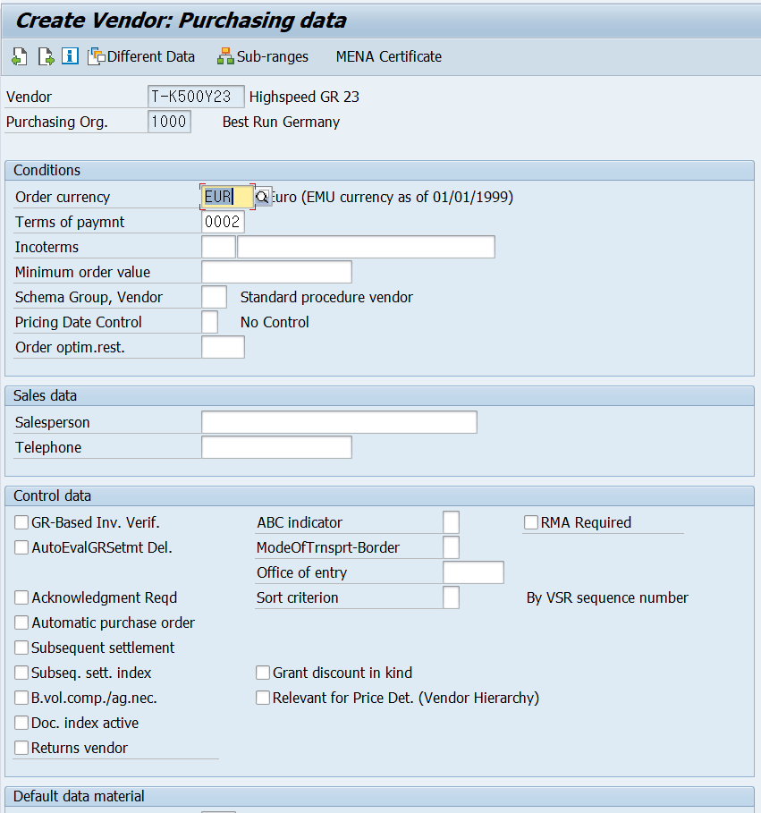
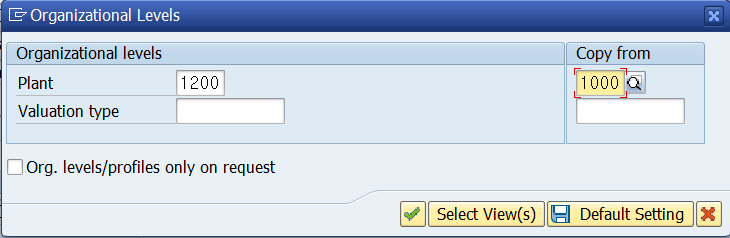
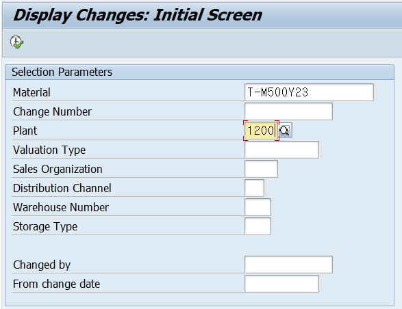

# UNIT 2. Master Data

# Lesson 1. Maintaining Vendor Master Records

Incoterms300 

# Exercise 5.

* ## 시나리오

  

  

* ## 실습

  

  #### 위의 경로 또는 *XK01* 로 들어간다.

  

  

  

  

  

  

  

  

  

  

  

  

  

  

  

  

  

  

  

  

  

  

  #### Change로 들어가

  

  #### Purchasing data의 checkbox를 클릭후 Enter로 들어가

  

  #### 판매자와 판매자 연락처를 추가하고 저장한다.

  

  

  ### 주의사항

  

  로 들어갈 경우 회계 뷰만 만들어지게 된다.

#### 

 

# Lesson 2. Maintaining Material Master Records

Production Resource and Tools 

# Exercise 6. 

* ## 시나리오

  

  

* ## 실습

  

  

  

  

  

  

  

  

  

  

  

  

  

  

  

  
  
  
  
  
  
  
  
  
  
  
  
  
  
  
  
  
  
  
  
  
  
  
  
  

# Exercise 7. 

* ## 시나리오

  

* ## 실습

  

  

  

  

  

  

  

  

* ## Optional

  

  

  

  

  

  

  

# Lesson 3. Using Entry Aids for Master Data Maintenance

# Exercise 8. 

* ## 시나리오

  

  

* ## 실습

  

  

  

  

  

  

  

  

  

  

  

  

  
  
  
  
  
  
  
  
  

# Lesson 4. Performing Mass Maintenance

