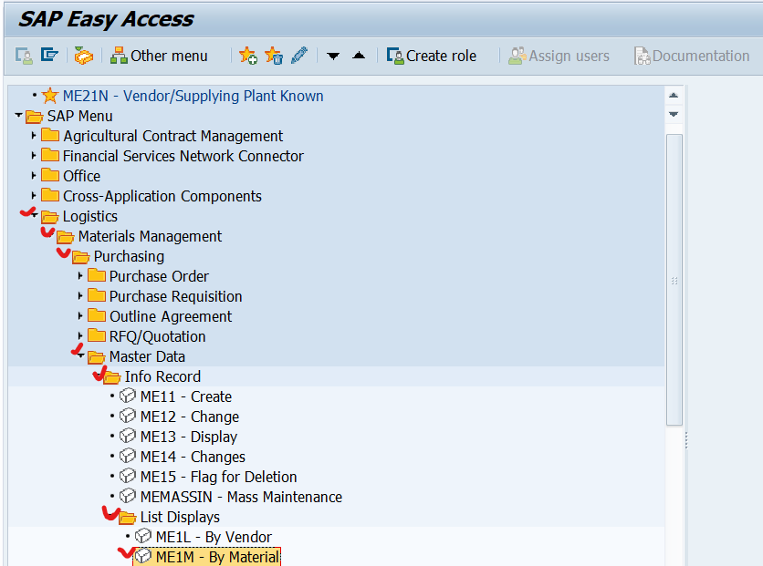

# UNIT 3. Stock Material Procurement

# Lesson 1. Applying Conditions in Purchasing

# Lesson 2. Handling Requests for Quotations and Quotation Processes

불편해서 잘 쓰지 않는 트랜잭션

# Exercise 9. 

* ## 시나리오 

  

  

* ## 실습

  

  

  

  

  

  

  

  

  

  

  

# Exercise 10.

* ## 시나리오

  

  

* ## 실습

  
  
  
  
  
  
  
  
  
  
  
  
  
  
  
  
  
  
  
  
  
  
  
  
  
  
  

# Lesson 3. Creating Purchase Orders with Reference

# Exercise 11.

* ## 시나리오

  

  

* ## 실습

  

  

  

  

  

  

  

  

  

  

  

  

  

  

  

  

  

  #### ME9F로 접속한 후

  

  

  

  

  
  
  
  
  
  
  

# Lesson 4. Maintaining Purchasing info Records

# Exercise 12.

* ## 시나리오

  

* ## 실습

  

  

  

  

  

  

  

  

  

  

  

  

  

  

  

  

  

  

  

# Lesson 5. Analyzing Material Valuation

# Lesson 6. Posting Goods Receipts for Purchase Orders

# Exercise 13.

* ## 시나리오

  

  

* ## 실습

  

  

  

  

  

  

  

  

  

  

  

  

  

  

  

  

  

  

  

# Lesson 7. Entering Invoices with Reference to Purchase Orders 

# Exercise 13.

* ## 시나리오

  

  

* ## 실습

