edu.

1

edu

cl-b-23

/nse11

파일 맨 앞에는 항상 z나 y 마지막은 b23

ztstudent_b23

기본적으로 와야 하는 필드

mandt

콘솔창에 /nse11 을 친 후 ZTSTUDENT_B23 테이블을 만든다. nse11을 통해 이후 다시 접근 가능

테이블에 들어갈 컬럼들을 생성해준다.

기본적으로 와야 하는 필드 : mandt

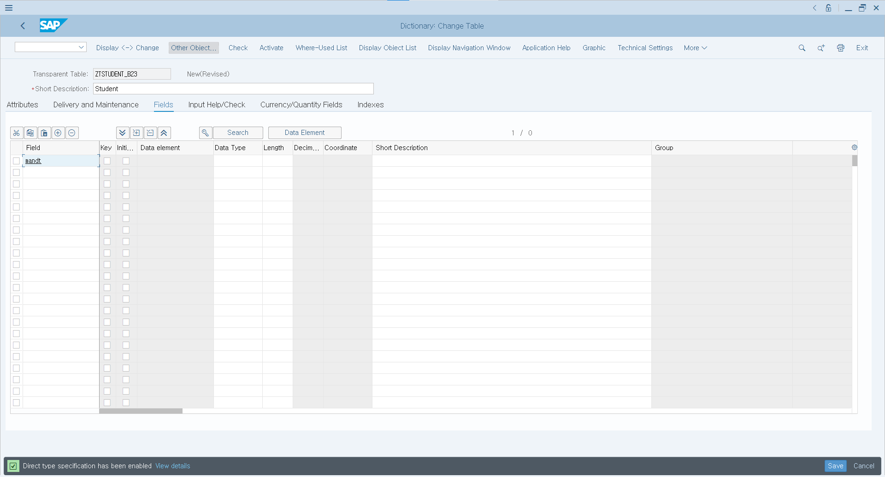

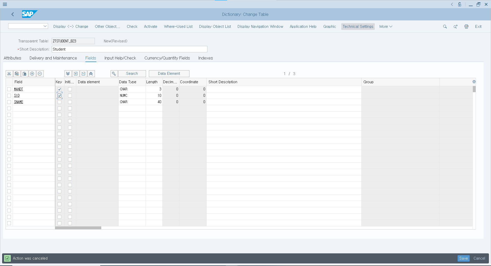

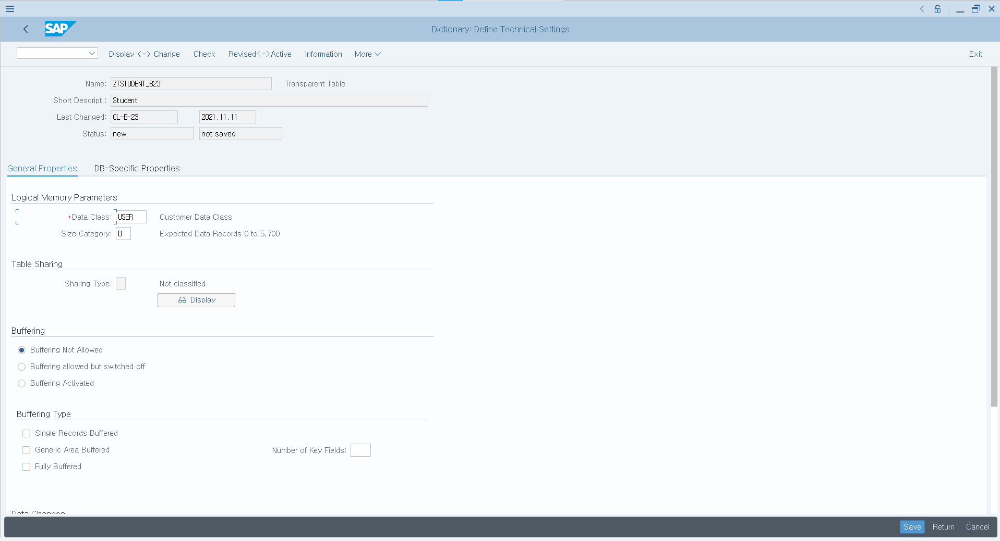

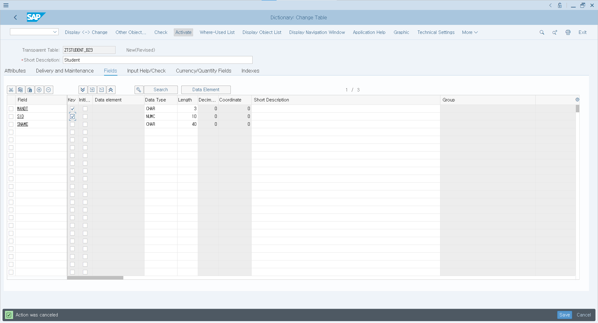

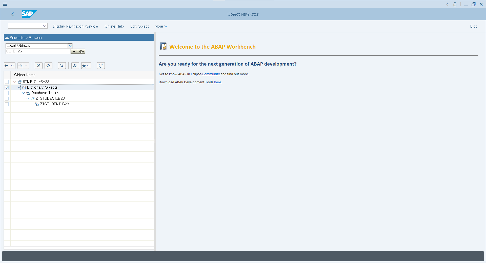

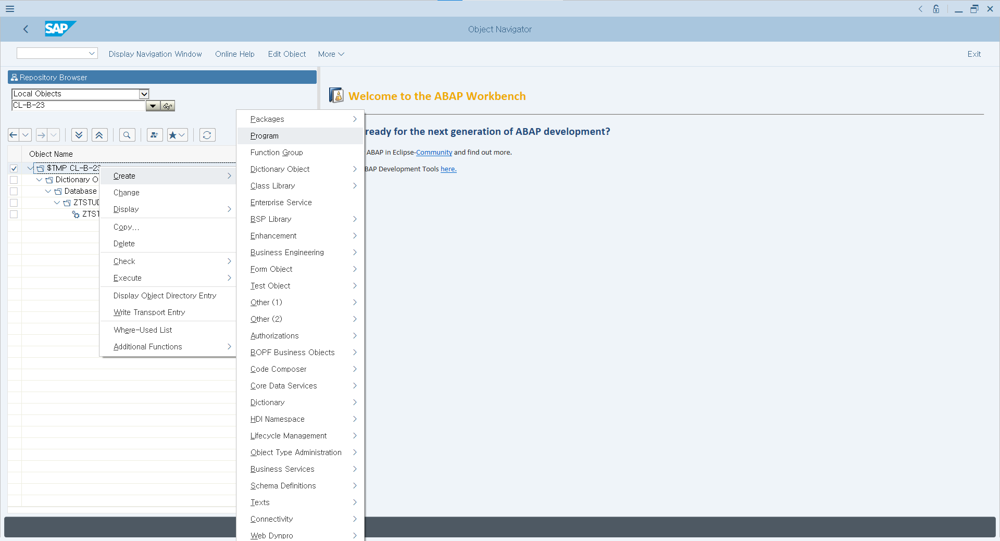

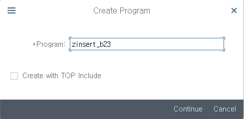

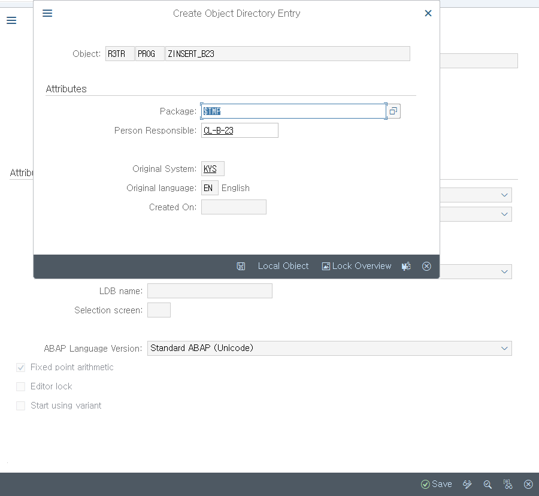

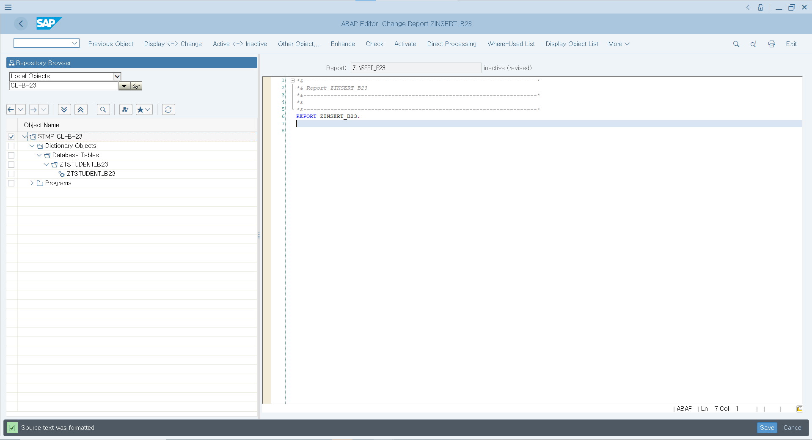

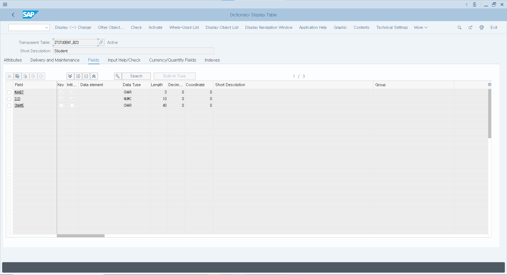

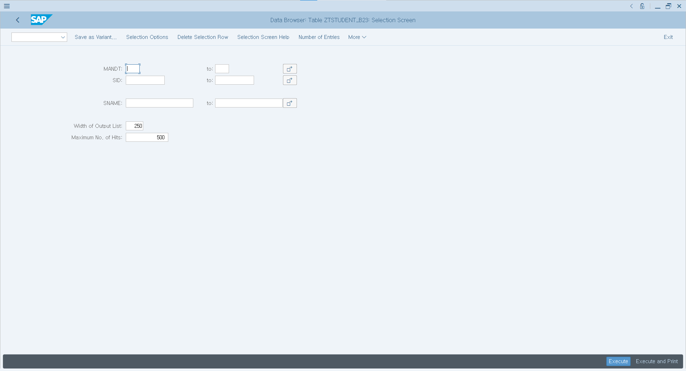

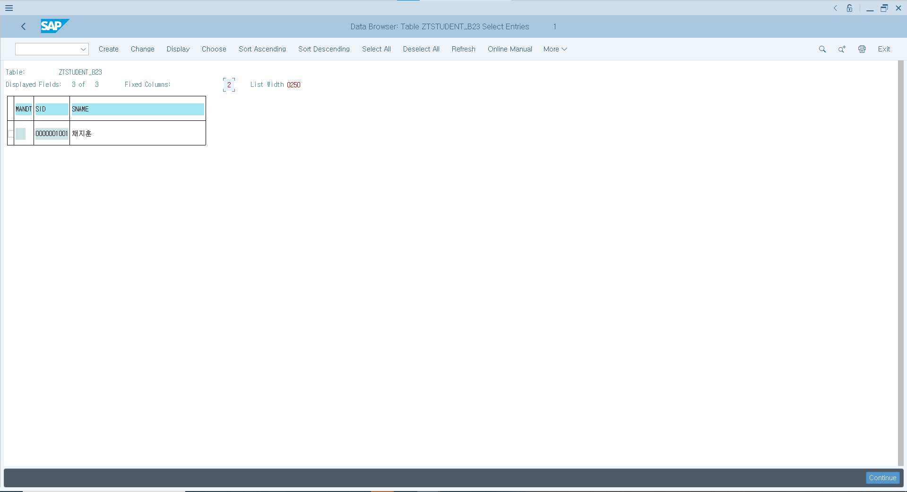

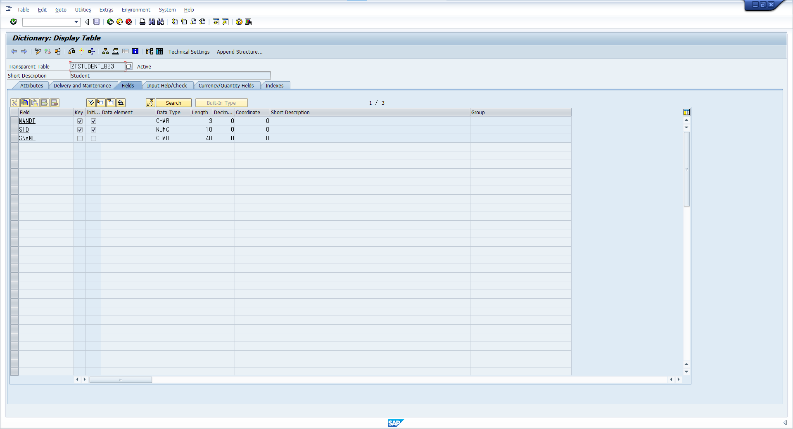

standard tool bar = system tool bar / title bar / application tool bar / statusbar

테이블을 만든 후 항상 저장하고 activate해 준다.

프로그램도 마찬가지로 실행하기 전에 activate로 바꿔주고 실행

테이블을 copy 할 수 있다. 

nse80

nse11

종료 커멘드

/nend : 종료 의사를 묻는 컨펌팝업이 뜬다.

/nex : 종료 의사를 묻는 컨펌팝업이 뜨지 않고 종료된다.

기본 설정

옵션에서 테마는 sap signature theme

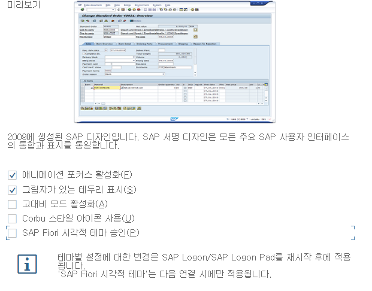

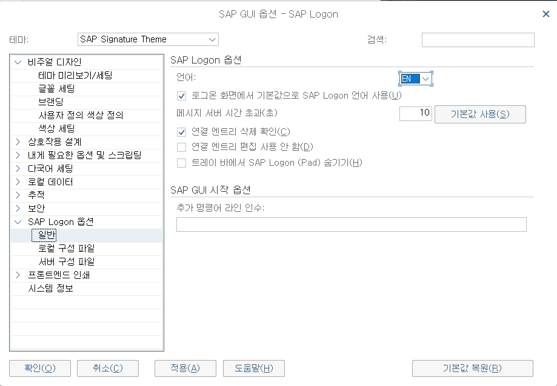