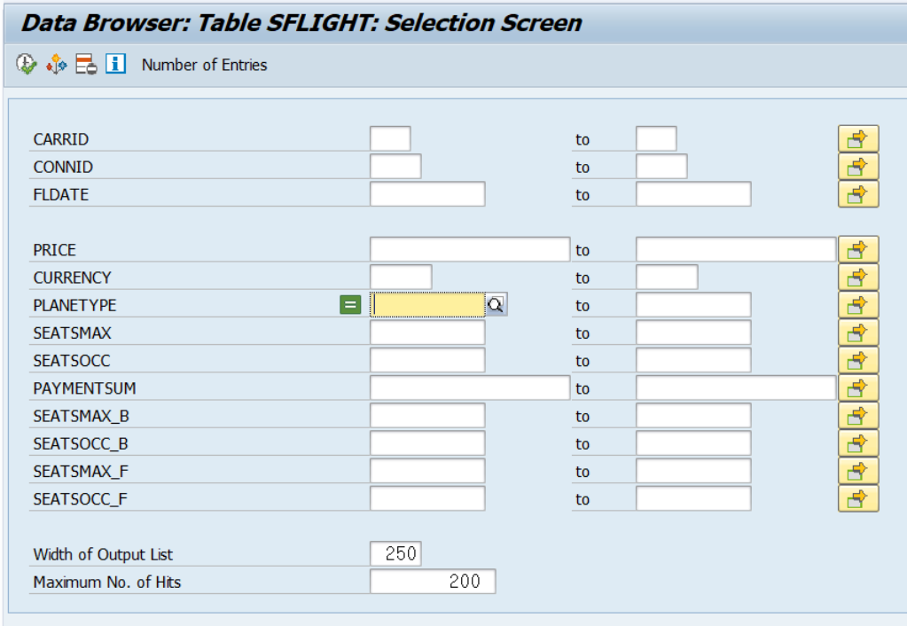
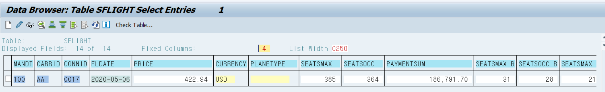

SELECT-OPTIONS에서 빈 값인 데이터 조회하는 방법


```ABAP
*&---------------------------------------------------------------------*
*& Report ZB23_00001M
*&---------------------------------------------------------------------*
*&
*&---------------------------------------------------------------------*
REPORT zb23_00001m.

DATA: gwa_spfli TYPE spfli.
DATA: gt_spfli TYPE TABLE OF spfli.

SELECT * UP TO 5 ROWS FROM spfli INTO TABLE gt_spfli.

LOOP AT gt_spfli INTO gwa_spfli.
  AT FIRST.
    WRITE:/ 'Flight Details'.
    WRITE:/ 'Airline Code' COLOR 5, 14 'Connection No.' COLOR 5,
            29 'Departure City' COLOR 5, 44 'Arrival City' COLOR 5,
            58 'Distance' COLOR 5.
    ULINE.
  ENDAT.
  AT NEW carrid.
    WRITE:/ gwa_spfli-carrid,
          ': New Ariline'.
    ULINE.
  ENDAT.
  WRITE:/ gwa_spfli-carrid,
          14 gwa_spfli-cityto,
          29 gwa_spfli-cityfrom,
          44 gwa_spfli-cityto,
          58 gwa_spfli-distance.
  AT END OF carrid.
    ULINE.
    WRITE:/ 'End of Airline:',
            gwa_spfli-carrid.
    ULINE.
  ENDAT.
ENDLOOP.
```


```ABAP
*&---------------------------------------------------------------------*
*& Report ZB23_00002M
*&---------------------------------------------------------------------*
*&
*&---------------------------------------------------------------------*
REPORT zb23_00002m MESSAGE-ID zmessage.

TABLES: sflight, sscrfields.

SELECTION-SCREEN BEGIN OF LINE.
  SELECTION-SCREEN COMMENT 1(10) TEXT-001 FOR FIELD p_1.
  PARAMETERS : p_1 LIKE sflight-carrid.

  SELECTION-SCREEN POSITION POS_LOW.
  PARAMETERS: p_2 LIKE sflight-connid.
SELECTION-SCREEN END OF LINE.

SELECTION-SCREEN SKIP 2.

SELECTION-SCREEN ULINE.
SELECTION-SCREEN ULINE /1(10).
SELECTION-SCREEN ULINE POS_LOW(10).
SELECTION-SCREEN ULINE POS_HIGH(10).

SELECTION-SCREEN PUSHBUTTON /POS_LOW(10) TEXT-002 USER-COMMAND psh.

SELECTION-SCREEN BEGIN OF BLOCK block WITH FRAME TITLE TEXT-003.
  PARAMETERS: p_3 TYPE c.
  SELECT-OPTIONS: s_1 FOR sflight-carrid.
SELECTION-SCREEN END OF BLOCK block.

SELECTION-SCREEN BEGIN OF BLOCK block2 WITH FRAME TITLE TEXT-004
  NO INTERVALS.
  PARAMETERS: p_4 TYPE c.
  SELECT-OPTIONS: s_2 FOR sflight-carrid.
SELECTION-SCREEN END OF BLOCK block2.
SELECTION-SCREEN FUNCTION KEY 1.
INITIALIZATION.
MOVE 'Func key1' TO sscrfields-functxt_01.

AT SELECTION-SCREEN.
  IF sscrfields-ucomm = 'FC01'.
    MESSAGE e001.
  ENDIF.
```


 Sapkorea21!

```ABAP
*&---------------------------------------------------------------------*
*& Report ZB23_00003M
*&---------------------------------------------------------------------*
*&
*&---------------------------------------------------------------------*
REPORT zb23_00003m.

DATA: g_total TYPE i,
      g_cnt   TYPE i,
      g_index TYPE i.

DATA: gt_sflight TYPE TABLE OF sflight WITH HEADER LINE.

START-OF-SELECTION.
  SELECT *
    INTO CORRESPONDING FIELDS OF TABLE gt_sflight
    FROM sflight.

  DESCRIBE TABLE gt_sflight LINES g_total.

  LOOP AT gt_sfLight.
    g_cnt = g_cnt + 1.
    PERFORM progress_indicator
    USING g_cnt g_total 'Progressing...'.
  ENDLOOP.

  WRITE 'SUCCESS'.

*&---------------------------------------------------------------------*
*& Form PROGRESS_INDICATOR
*&---------------------------------------------------------------------*
*& text
*&---------------------------------------------------------------------*
*&      --> P_CUR
*&      --> P_TOTAL
*&      --> P_TEXT
*&---------------------------------------------------------------------*
FORM progress_indicator  USING    VALUE(p_cur)
                                  VALUE(p_total)
                                  VALUE(p_text).
  DATA: text(50) TYPE c,
        idx1(3)  TYPE n.

  idx1 = ( p_cur / p_total ) * 100.
  CONCATENATE idx1 ' % : ' p_text INTO text.

  CALL FUNCTION 'SAPGUI_PROGRESS_INDICATOR'
    EXPORTING
      percentage = idx1
      text       = text
    EXCEPTIONS
      OTHERS     = 0.
ENDFORM. "PROGRESS_INDICATOR
```

progressing 과정을 퍼센트로 보여준다.


