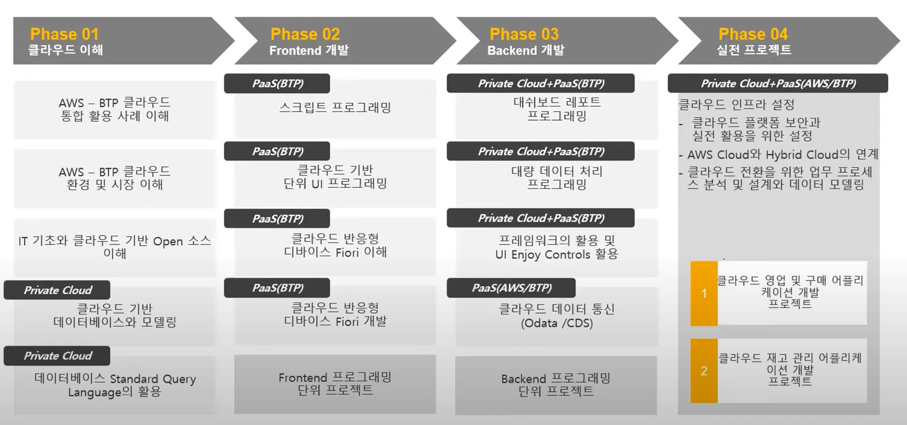

# 교육과정 목표 - SAP 클라우드 기반 프로그램 개발

SAP **B**usiness **T**echnology **P**latform (BTP) Cloud 를 통한 프로그램 개발  
Public Cloud와 Private Cloud를 함께 사용 하는 **Hybrid Cloud**  
Public Cloud 기반에서는 SAPUI5(html5기반) 를 통해 Cloud 기반에서 구동되는 웹앱 형태의 어플리케이션을 개발할 것이며   
Pribate Cloud 기반에서는 Application Server ABAP 프로그래밍을 중심으로 비지니스 어플리케이션을 개발할 것이다.  

비지니스의 중요 부분들을 클라우드로 데이터를 오픈하는 것을 꺼려하는 경우가 많다. ==> Private Cloud 기반으로 구축 ==> Cloud에서 확장을 해서 사용할 수 있도록 한다.  

기업들 입장에서 클라우드별 강점에 따라 다양한 클라우드를 혼용하여 사용하는 경우가 있다. 이러한 경우를 **Multi Cloud**라고 한다.  
교육과정에서는 AWS Cloud 를 사용할 예정이다.  

Odata / RFC - 데이터를 주고받는 수단

Server Side / Front End

# 프로그램 언어와 데이터활용
## 기초 개념과 사전 학습 방법

## 데이터 베이스 (SQL) 주요 목차
(개념을 정확하게 이해하는 것이 중요)
(개념이 그대로 프로그램에 적용되는 부분)
(앞서 공부하고 입교)
1. ### 데이터베이스
    프로그램 언어와 데이터 베이스의 관계
    데이터베이스 형태(특히 관계형 데이터베이스 - 테이블과 테이블이 서로 참조가 되는 데이터베이스(중복이 해소된다.))
    * 마스터 데이터 성격의 데이터(일괄적으로 유지 되어야 하는 데이터)
    * 트랜잭션(거래) 데이터 성격의 데이터
    
2. SELECT 구분
    select 칼럼이름 from 테이블명 where 조건
    

3. 그 외의 구분
    * INSERT - 입력
    * UPDATE - 정보의 갱신
    * DELETE - 
    * CREATE - 테이블을 생성
    * DROP - 
    등등,,,
 
    데이터를 검색하는 방법 (SELECT)이 개발에서는 가장 중요하며 난이도가 높다.  
    DML 과 DDL 개념  
    * DDL : Data Define Language 의 약자로, 스키마/도메인/테이블/뷰/인덱스를 정의/변경/제거할 때 사용하는 언어이다.  
    테이블을 생성하고, 테이블 내용을 변경하고, 테이블을 없애버리는 것.  
    흔히 CREATE, ALTER, DROP 을 떠올리면 된다.  
 
    * DML : Data Manipulation Language 의 약자로, Query(질의)를 통해서 저장된 데이터를 실질적으로 관리하는 데 사용한다.  
    테이블 안의 데이터 하나하나를 추가하고 삭제하고 수정하는 것.
    흔히 INSERT, DELETE, UPDATE 를 떠올리면 된다.

4. 데이터 베이스 설계
    제약조건
    키 (PK, FK)

5. 서브쿼리 (예시 이해)
    쿼리가 의미하는 것을 이해하는 정도 수준 필요
    이해가 되더라도 문법이 틀리거나, 실수로 프로그램이 수행되지 않는 경우가 있으나, 이런 부분의 능력이 지속적으로 향상됨

6. ADDITION : 조인, View, 데이터베이스 함수 등